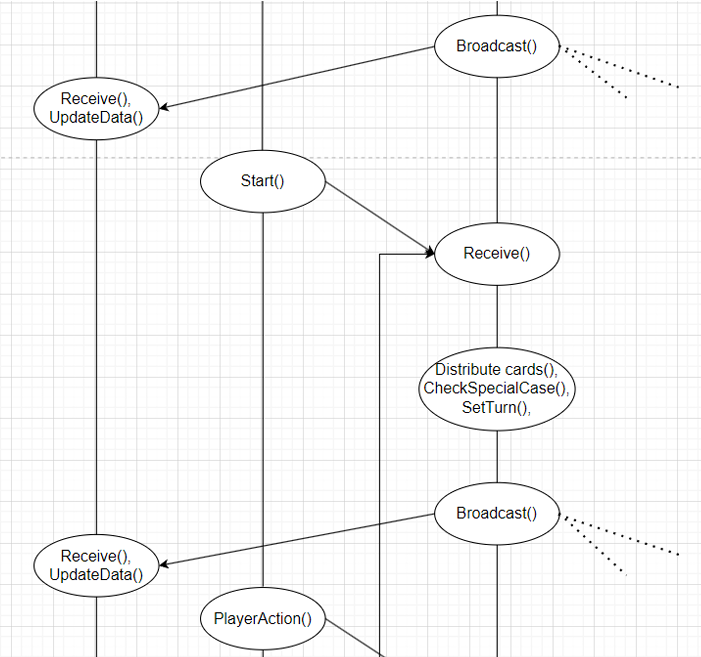

# Game Xì Dách (Nhóm 21 - NT106.O22)

## Giới thiệu

Đây là dự án game Xì Dách (Blackjack) được phát triển bởi Nhóm 21 cho môn học NT106.O22. Dự án gồm hai phần:
- **XiDach_Client**: Ứng dụng Windows Forms cho người chơi.
- **XiDzach_Server**: Ứng dụng server để quản lý phòng chơi và kết nối các client.

## Mục tiêu dự án

- Xây dựng một hệ thống game Xì Dách nhiều người chơi qua mạng LAN.
- Luyện tập kỹ năng lập trình C#, sử dụng mô hình client-server, giao tiếp socket.
- Tăng cường khả năng làm việc nhóm và phát triển phần mềm thực tế.

## Kiến trúc hệ thống

- **Client**: Giao diện người dùng, xử lý logic game phía người chơi, gửi/nhận dữ liệu với server.
- **Server**: Quản lý phòng chơi, xử lý logic chung, phân phối lượt chơi, kiểm tra thắng/thua.
- Giao tiếp giữa client và server sử dụng TCP Socket.





## Luồng hoạt động chính

1. Người chơi mở client, nhập IP và port để kết nối server.
2. Đăng nhập, tạo phòng hoặc tham gia phòng chơi.
3. Server phân phối bài, quản lý lượt chơi, nhận lệnh từ client.
4. Kết thúc ván, server trả kết quả, cập nhật điểm số.


## Tính năng nổi bật

- Đăng nhập, tạo phòng, tham gia phòng chơi.
- Giao diện trực quan, dễ sử dụng.
- Hỗ trợ nhiều người chơi/phòng.
- Luật chơi Xì Dách truyền thống.
- Ảnh bài đẹp, hiệu ứng đơn giản.

## Cấu trúc thư mục

```
GameXiDach_Nhom21_NT106.O22/
│
├── XiDach_Client/
│   ├── Core/
│   ├── Model/
│   ├── Asset/Pictures/
│   ├── GameRoom.cs, Lobby.cs, WelcomeForm.cs, ...
│   └── ...
├── XiDzach_Server/
│   ├── Model/
│   ├── Program.cs
│   └── ...
└── GameXiDach_Nhom21_NT106.O22.pdf (Báo cáo)
```

## Yêu cầu hệ thống

- Windows OS
- .NET Framework 4.7.2 trở lên
- Visual Studio 2017/2019/2022 (khuyến nghị)

## Hướng dẫn cài đặt & chạy

### 1. Build Server

1. Mở thư mục `XiDzach_Server` bằng Visual Studio.
2. Build project `XiDzach_Server`.
3. Chạy file `XiDzach_Server.exe` trong thư mục `bin/Debug`.

### 2. Build Client

1. Mở thư mục `XiDach_Client` bằng Visual Studio.
2. Build project `XiDach_Client`.
3. Chạy file `XiDach_Client.exe` trong thư mục `bin/Debug`.

### 3. Kết nối

- Đảm bảo server đã chạy trước khi mở client.
- Nhập IP và port của server trên giao diện client để kết nối.

## Ảnh minh họa


## Kiểm thử

- Đã kiểm thử kết nối nhiều client tới server trên cùng mạng LAN.
- Đã kiểm thử các trường hợp: tạo phòng, tham gia phòng, chơi nhiều ván liên tiếp, mất kết nối.
- Đảm bảo không phát sinh lỗi nghiêm trọng trong quá trình chơi.
